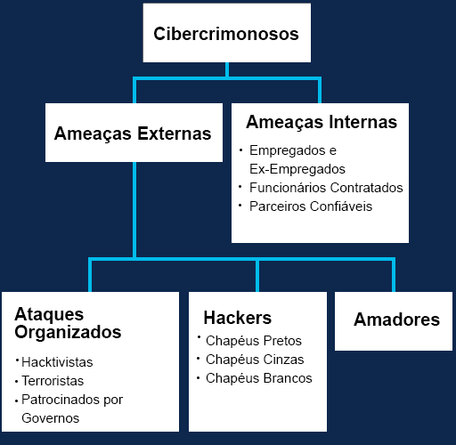

# 1.1.4 Ameaças Internas vs Externas

**As Ameaças Internas**:
Funcionários atuais ou antigos;
Outros parceiros de contrato que acidental ou intencionalmente manipulam dados confidenciais ou ameaçam as operações de servidores ou dispositivos de infraestrutura de rede ao conectar a mídia infectada ou acessar e-mails ou sites mal-intencionados.

**As Ameaças Externa**:
Invasores amadores ou qualificados que podem explorar vulnerabilidades em dispositivos de rede ou podem usar técnicas de engenharia social, como truques, para obter acesso aos recursos internos de uma organização.